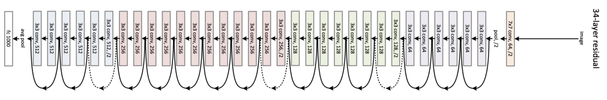
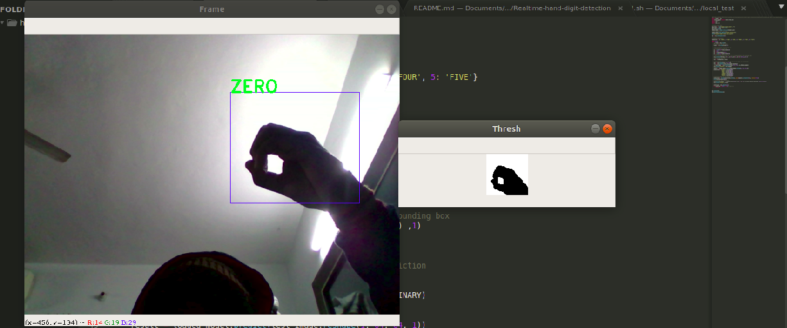
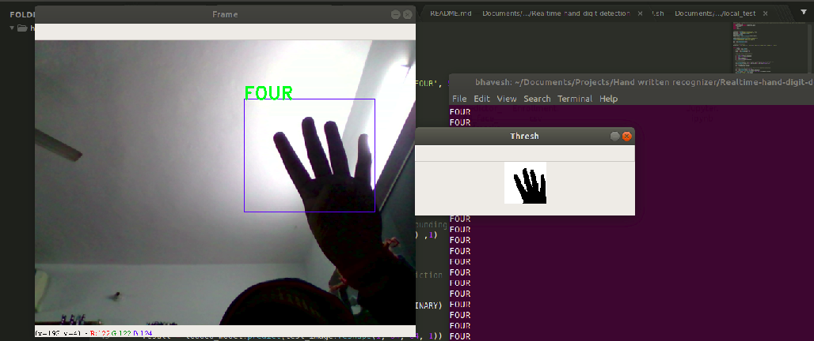
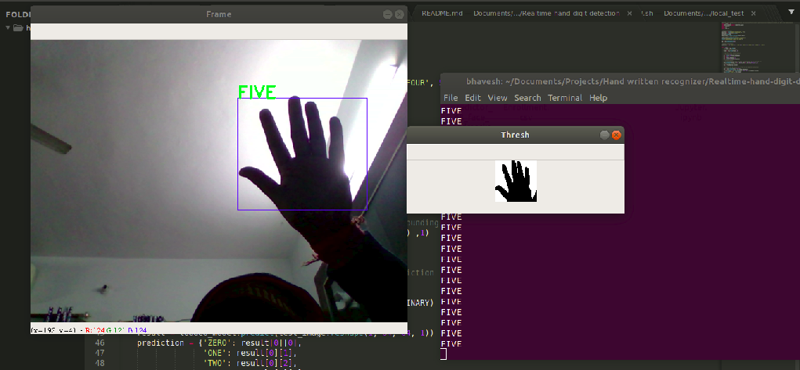

# Real-time-Hand-Gesture-Digit-Recognition-using-ResNet50

# **Real-time-Hand-Gesture-Digit-Recognition-using-ResNet50**
This is the hand digit gesture recognition. The model is a Convolutional Neural network known as ResNet.

**Model Architecture**
Following the high level architecture of ResNet 50.

Following are the layers that I have used for training the model for around 20 epochs and a batch size of 120.
For auto labelling the train images, I have used Tensorflow's Image Generator. 

You can also train it using your own data by running the collect-data.py file.

CONV2D -> BATCHNORM -> RELU -> MAXPOOL -> CONVBLOCK -> IDBLOCK*2 -> CONVBLOCK -> IDBLOCK*3
    -> CONVBLOCK -> IDBLOCK*5 -> CONVBLOCK -> IDBLOCK*2 -> AVGPOOL -> TOPLAYER
    
   
    
**Results**

Following are some results out of the output window.

